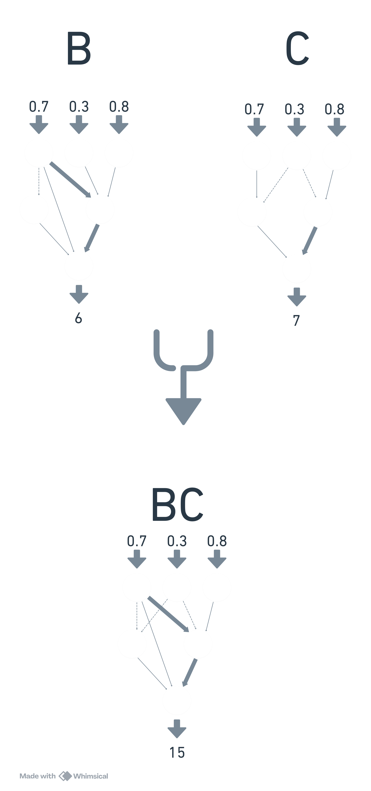

# DragonWoodAI

## Introduction

I, like most parents, enjoy playing board games with my kids and one they particularly enjoy is Dragonwood. I have played quite a few games with my kids and started to wonder what the best strategy was and how I can increase my probability of winning. It seems that my kids seem to have an innate understanding of the probabilities involved and have started to beat me more and more.

My approach to understanding this problem is to create a way of playing thousands of games of Dragonwood which should enable me to test out strategies and see which are most successful. Once a suitable system has been developed a stretch goal would be to train an AI to play against a deterministic opponent and see if an AI can find a better approach than I can.

## The Game

The game itself is quite simple and easy to learn but there are a number of decisions the players need to make and lots of scope for elementary strategy even though there is a large probabilistic element to the game. The game is summarised in the rules as:

>*Play cards to earn dice, which you will roll to defeat a fierce array of creatures, or capture magical items that may help you along the way. Whoever earns the most victory points wins.*

The players play Adventurer cards from their hand of up to 9 to capture one of 5 Dragonwood cards. The adventurer cards are numbered 1-12 and are of 5 different colours. A player can make the following 4 decisions:

- Strike - attack with cards that are in order regardless of colour.
- Stomp - attack with cards that are all the same number.
- Scream - attack with cards that are all the same colour.
- Reload - Draw a card

The player gets a dice per card they are attacking with and uses them to defeat Dragonwood cards.

The Dragonwood cards being attacked have different defence values for each type of attack and the player must get that value or higher to beat that card. The Dragonwood cards can be either creatures that give the player victory points when beaten or enhancements which give the user extra abilities or modifiers to their dice roll.

One point to note is that the dice are 6 sided dice but with the values 1, 2, 2, 3, 3, 4. This gives the dice an [Expected Value](https://en.wikipedia.org/wiki/Expected_value) per roll of 2.5.

An example attack is included below to illustrate the decision making process.

|  |
| :--: |
| Example attack |

The decision to use which cards in a players hand to try an defeat which Dragonwood cards is the decision we are trying to get an AI to make. I'm hoping to be able to get an AI to identify which cards to use to defeat the Dragonwood cards and also which cards to target to give it the best chance of winning.

## Goals

Given the scope of the problem and the initial wide variety of possibilities, I set out some initial goals to allow me to focus my efforts. As this was an exercise to explore what's possible these are very flexible and will be amended based on the progress I make and research I undertake.

1. Create a model to allow me to play Dragonwood programmatically in Python
1. Develop an rule based algorithm to play Dragonwood deterministically and model how a player selects which cards to attack and when.
1. Develop an AI that can play Dragonwood using reinforcement learning that is as good, or better than the rule based algorithm.
1. Learn some strategies from the AI to improve my chances against my kids.

As a stretch goal for this activity I want to leave as much of the game logic to be determined by the AI. So the AI should be given as little of the games' rules and should learn through its interaction with the game instead of explicit structural learning.

### Goal 1 - Python Model

The first step of the process is to create a model within python to allow me to play Dragonwood, based on the [rule-set](https://aadl.org/files/catalog_guides/Dragonwood%20-%20rules.pdf) published online. To do this I created a custom class within python that contained all the objects and methods to complete a game. A simplified version of this model is included below. I have left off the attributes and methods for simplicity

|  |
| :--: |
| Dragonwood model diagram |

I did make a number of simplifying assumptions that shouldn't affect the overall gameplay but will make the model more streamlined.

- I removed certain cards that are only chance based and effect all players with the same probability. These shouldn't affect how the AI plays over a large number of iterations.

- Certain enhancements I did not model and I just focussed on cards that modify a users dice roll. I also only dealt with permanent enhancements not ones that require the AI to decide whether to use them on each attack. This allows the AI to focus on the task of attacking and can be added in later once a successful algorithm and system have been developed.

- As strategy will be slightly different dependant on the number of players, Initially I will play with 4 players; one controlled by AI (I called her Alice) and the other 3 by the deterministic algorithm (Bob, Charles and Dylan).

### Goal 2 - Deterministic algorithm

After the model was created I needed to develop a rule based approach to selecting an attack. This is what I will eventually judge any AI's success or failure against. After trail and error the following algorithm was developed.

1. Find all possible attacks and card combinations from a players current hand.
1. For each card combo work out the expected value of the number of dice. This is the number of cards times by the Expected Value of the dice - 2.5.
1. Add any modifiers from enhancements
1. Take away the score on the card that is trying to be captured.
1. Pick the options with the lowest positive score.

|  |
| :--: |
| example rule based decision |

#### Sensitivity Analysis

As part of deciding on the best algorithm I performed some analysis on what is the most successful formula for a rule based algorithm. To work out the the values of a and b that are most successful in the below formula:

$$(c \times (Ev_{dice}+a)+b)- score$$

Where:

- $c$ is the number of attacking cards
- $Ev_{dice}$ is expected value of the dice.
- $ score $ is the Dragonwood card's score to beat

To find the best values for a and b I kept 3 players' $a$ and $b$ values constant at 0 and then searched through candidate values running a thousand games for each combination and seeing which  gave the best points per turn. After running 10000 games the results showed the optimum formula was:

$$(c \times (2.50+0.38)-0.13) - score$$

|  |
| :--: |
| Search matrix for values of $a$ and $b$ |

### Goal 3 - Dragonwood AI

#### Introduction to reinforcement learning

Reinforcement Learning is a paradigm within machine learning where an AI controlled agent learns optimal behaviour within an environment by exploring actions and seeing their impact on a reward function. The main advantage of reinforcement learning is that we do not need a labelled data set on which to train our model, it also works well within games as we have an easily identifiable agent in the form of players.

Reinforcement learning involves the interaction of the following elements:

- **Environment.** The environment is the entity we are a looking to learn from. In our case this is the Dragonwood game and more specifically the Dragonwood model created in Python. The environment provides the agent with information it's state and the impact of the agent's actions.

- **State.** The state of the environment is a set of variables that describe the current game. This is something we have to devise and make sure it includes enough information for the AI to learn from. It could be the cards in the players hands, the players score, which cards have been captured. How this information is encoded is also very important.

- **Action.** The action or decision that the AI has performed. In our case this will be one or more adventurer cards to attack one Dragonwood card.

- **Reward.** This is a function that provides a numerical measure on the suitability of the AI's action within the environment for the given state. This is for us to decide and should reward the AI to prioritise beneficial behaviour. In our case we want to prioritise not only getting points but also winning the game.

- **Agent.** An AI controlled user that can perform actions on the environment given a game state and receives rewards. In our case there will be a single AI agent and a number of rule based users that will perform actions but which we wont refer to as Agents for clarity. We will refer to our AI controlled agent as Alice throughout.

|  |
| :--: |
| Learning diagram |

There are multiple different techniques within reinforcement learning, for this specific problem I investigated the below two:

- [Q-Learning](https://en.wikipedia.org/wiki/Q-learning). A reinforcement learning technique where multiple runs of the game produce a table with the best action for every possible move a player can make.

- [Neuroevolution of augmenting topologies (NEAT)](https://en.wikipedia.org/wiki/Neuroevolution_of_augmenting_topologies). A genetic algorithm where a neural network is varied over time to find the best performing architecture.

#### Q-Learning

Q-learning is a branch of Reinforcement learning where the agent learns by iterating over the possible actions multiple times to learn which actions lead to the best outcomes. It does this through the generation and iterative update of what's known as the Q-Learning Table.

The Q-Learning Table is a $N \times M$ matrix $Q$ with:

- $N$ being the number of possible states
- $M$ being the number of possible actions
- $Q_{nm}$ being the Q-value of action $n$ under state $m$

The Q-value is calculated iteratively and updated as the agent takes actions and receives rewards. In simple terms the higher the Q-Value the better the action $m$ under state $n$. As the Q-table is updated the agent will take the action with the highest Q-value for the current state.

The Q-value is updated according to a complex formula that includes a learning rate to allow for exploration of new possibilities as well as learning as from previous experience.

#### State and action space

The first step to implement Q-Learning would be to define the action space and state space to allow me to define the Q-table. As stated in the stretch goal for this task I wanted to try and not abstract away the game rules where possible. This means I want to just and provide the AI Agent with the game and action state and to allow it to learn it's behaviour based on the reward function.

To provide the Agent with the most amount of information to make its decision and without limiting its choices programmatically the state would need to represent:

- Which adventurer cards are in the player's hand out of the possible 62.

- Which Dragonwood cards are in the landscape out of a possible 34.

Given this state the actions would then be:

- Which adventurer cards has the agent selected to attack with.

- Which Dragonwood card has the agent selected to attack.

Given this definition the action-state space does become quite large.

- For a player's hand it could be up to 9 cards chosen without replacement from the deck of 62 which gives us 24,228,029,107 hands.

- For the cards to attack it could be any combination of 5 cards from the 34 cards available which gives up 331,212.

A very large action-state space means that the model will need to be run longer to make sure all possible combinations are investigated multiple times. One way to reduce the action-state space would be to simplify how the state is represented or to use Deep Q-Learning which uses a neural network to represent the Q-table. However, I felt that there might be other algorithms and techniques out there that would allow me to train the AI without simplification. this leads us to my second technique.

#### NEAT Intro

NeuroEvolution of Augmenting Topologies (NEAT) is an algorithm developed in 2002 to generate and vary neural networks in a way based on genetic principals. The algorithm varies both the weights, biases and structure of the neural network by mutating and reproducing neural networks to find the best structure to maximise the reward function.

So instead of having a fixed network architecture where the best solution is found by varying the weights and biases, NEAT varies both the actual network structure as well as the weights. In practice this means that the optimal solution can be found quicker as the network itself has a lot of impact on its utility.

#### NEAT Algorithm

The algorithm works by starting with a user defined input and output layer. In our case it will be our attack option encoded as an input and our output will be a number in \[0,1\] to show how good the network thinks that move is.

The input and output nodes will stay constant through the evolution but nodes can and will be added to the hidden layer and connections to those nodes will also be added according to the configuration of the process. This process is known as **mutation**.

|  |
| :--: |
| Base Networks |

To decide which networks are the most successful we use a measure known as fitness within NEAT terminology but is effectively a reward function.

Once networks have been generated/mutated and their fitness calculated, new networks are generated by reproduction between 2 high performing networks. This reproduction ensures beneficial traits of the weights and network are combined to hopefully improve the performance of the network.

|  |
| :--: |
| reproduction |

The process is repeated for multiple generations with mutation, variation in the weights and reproduction all happening according to various hyperparameters within the process. Luckily all this is handled by a brilliant implementation of the algorithm in the [Neat-Python](https://neat-python.readthedocs.io/en/latest/index.html) library. The library also tracks a measure of the genetic diversity within the population and maintains a record of the best performing networks and whether a species has become stagnant i.e. has stopped improving.

#### NEAT Process

Now we have a technique selected and before we go into the important step of input encoding I thought it would be good to cover at a high level how the environment, agent and reward function are going to be used with this technique.

1. A network is provided by the NEAT algorithm.
1. This network is then passed to the Dragonwood game and assigned to the Alice player.
1. A game is then played between Alice and the 3 other players.
1. Each time Alice attacks, the environment provides a list of all possible combinations of attacking cards and Dragonwood cards to attack.
1. Each attack combination is then encoded and inputted into the network.
1. If any combination score from the network is over a certain limit, in our case 0.33, the attack combination with the highest score from the network is selected, otherwise draw a card.
1. The decision is then enacted by the environment.
1. This is repeated until the game ends.
1. The reward is calculated for that network and game.
1. To make sure the networks are given a chance to understand the implications of their weightings and architecture 2000 games are run and Alice's average score passed to the NEAT algorithm.
1. The NEAT algorithm then varies the networks based on the reward gained.

This process is repeated until a certain number of iterations is passed or the reward function exceeds a user specified limit.

| |
| :--: |
| NEAT PRocess |

#### Reward Function

The reward function should be derived to make sure that the correct behaviour is being encouraged through the learning process. The reward function outputs a float number with higher being better. Initially, given our stretch goal of trying to make the AI learn rules instead of imposing rules on it, the AI was provided with a full list of possible attack options including ones that were statistically not possible to attain. I.e. the score of the card was higher than the highest possible dice roll for that option.

The first iteration of our Reward function was simple:

> *The reward would be the average amount of points obtained by the network in a game.*

#### Input Encoding

Now I have a reward function, a learning algorithm and a high level process, the final piece of the puzzle is how do I encode the game state to input into the neural network.

For the encoding to be successful it must:

- Include all relevant information that the network needs to make a decision.
- Be a $n \times 1$ array of floats within the range \[0, 1\]
- Be as simple as possible to allow the Neural Network to recognise the relationships between the state, actions and reward function.

This step was actually what took the longest time and included much searching of stack overflow and bothering ChatGPT. I eventually decided that for each attack option the following information would be encoded:

- Current cards in players hand and what cards are being used to attack - encoded as a vector of length 62 representing all cards with:

  - 0.5 if the card is in the hand but not in the attack option
  - 1.0 of the card is in the hand and in the attack option
  - 0.0 otherwise

- Current Dragonwood cards available to attack and which card to attack - encoded as a vector of length 21 representing all creatures and enhancements with:

  - 0.5 if the card is available but not being attacked
  - 1.0 of the card is available and selected for attack
  - 0.0 otherwise

- All players current points - encoded as a vector of length 4 with each element represented as the players score / 50 to get it within the range \[0,1\]

- Context on how far into the game you are - encoded as a vector of length 2.

This resulted in a input layer with 86 neurons.

#### Experiments

Our aim with all of these networks is to beat the rule based approach so to give me a number to aim for I ran the algorithm but only used the rule based approach, this gave me an average score of around 14 per game. For all of our experiments we need for the AI to be able to get more than this to say we have been successful.

#### Experiment 1

My initial runs weren't very successful and resulted in an average fitness of around 2-3 with a best fitness of 4, nowhere near our target of 14. After analysis of the code and reviewing the actions the network was taking I found the following problems

- The network was selecting options where it was weren't mathematically possible to win. i.e. the total card score was greater than any possible dice score. Interestingly this is what my children used to do.

- The encoding had some bugs in that meant it wasn't presenting a consistent state.

- Initially the encoding wasn't normalised to \[0,1\]

- There was an error in the encoding when there was was 2 of the same Dragonwood cards available to attack.

To try and stop the network from selecting options that weren't valid I changed the reward function to:

> *The reward would be the average amount of points obtained by the network in a game minus 0.5 for every time the network selects an impossible attack option.*

#### Experiment 2

After updating the encoding and reward function I was able to be a bit more successful. The network was now quickly learning not to play impossible card combinations and was eventually able to have an average score of 3 and with a best network value of 7. This is still not near the levels needed.

After review of the actions selected by the network it seemed to be drawing cards more often than needed and would only attack high value cards when it had a good chance of winning. This conservatism meant that cards with smaller attack values and points were being ignored completely. The cards were even being ignored when the network had valid attacks that had a very good chance of winning. It seems that the new reward function was causing the network to learn to be very cautious and the points it won for the smaller cards was not enough for it to prioritise those cards.

I then tried the following amendments to the reward function:

>- *Added a +10 to the reward when the player won the game.*
>- *Added -0.25 to the reward when the player drew a card that took it over the max hand size of 9 which would cause it to discard a card.*

These changes resulted in a slight increase in the average score to 7 but still didn't give me the changes I needed.

#### Experiment 3

It seems that the network was still being conservative and was drawing cards when it shouldn't be. A measure of success of playing in Dragonwood is the amount of value you get per card. The more cards you discard the less chance to get points you have. As a final attempt to get a less conservative player I changed the function to try and incorporate this. The new function was:

 $$\frac{score}{number\;of\;discarded\;cards} + {invalid\;choices}\times-0.5$$

 Unfortunately this had the opposite effect and after a few generations the network was only drawing cards and doing nothing else.

 #### Experiment 4

 I was starting to think that the state encoding was too complicated to allow the network to learn from. Before going back to the drawing board I decided to only provide attack options to the network that were possible. This does go against our stretch goal of trying to let the network learn the game rules but at this point I felt it was a good compromise to make.

 Once this had been implemented the network did converge on an answer much quicker and we saw a slight increase in the best performing network. However the best score of 8 was still pretty far from the value needed.

#### Experiment 5

At this point i had been working on getting the network right for a month and had changed quite a few variables with minimal change in the resultant reward function. I felt therefore it was time to review the input encoding. Simplification of the encoding would mean that more of the games logic would be abstracted away from the network but the current approach was not yielding results.

So I decided to simplify the encoding trying to put the least amount of information needed not worrying about abstracting away information. I ended up with the following encoding:

* length of attacking hand
* score to beat on selected Dragonwood card
* number of points of selected Dragonwood card
* scream modifier if the card is an enhancement
* strike modifier if the card is an enhancement
* stomp modifier if the card is an enhancement
* player 1 score
* player 2 score
* player 3 score
* player 4 score
* game length context

This encoding reduces the number of input nodes from 86 to 11.

When the process is running it can take hours to complete so I usually ran it in the evening or over the weekend. So I started it running on a Friday evening and went to bed.

#### Success

So after over 200 generations I ended Up with a network with a score of 16.6885. We now has a network that could compete with, and hopefully beat, my rule based algorithm.  

Population's average fitness: 8.94476 stdev: 5.79052
Best fitness: 16.38450 - size: (8, 14) - species 44 - id 22335
Average adjusted fitness: 0.449
Mean genetic distance 3.107, standard deviation 0.750
Population of 150 members in 8 species:
   ID   age  size  fitness  adj fit  stag
  ====  ===  ====  =======  =======  ====
    44   24    27     10.4    0.636     3
    45   20    21      6.9    0.421     6
    47   17     5      1.8    0.113     2
    48    8    32     13.4    0.817     0
    49    5    19      7.9    0.480     1
    50    4    19      7.6    0.461     1
    51    4    18      7.6    0.463     2
    52    1     9      3.3    0.201     0
Total extinctions: 0
Generation time: 362.522 sec (322.047 average)
Saving checkpoint to neat-checkpoint-201

Best genome:
Key: 18633
Fitness: 16.6885
Nodes:
        0 DefaultNodeGene(key=0, bias=-0.7395573638333613, response=1.0, activation=sigmoid, aggregation=sum)
        3645 DefaultNodeGene(key=3645, bias=1.7304809219021717, response=1.0, activation=relu, aggregation=sum)
        4321 DefaultNodeGene(key=4321, bias=1.9033812411004662, response=1.0, activation=relu, aggregation=sum)
        5309 DefaultNodeGene(key=5309, bias=0.5905094695409188, response=1.0, activation=sigmoid, aggregation=sum)
Connections:
        DefaultConnectionGene(key=(-11, 3645), weight=-1.2387335143649874, enabled=False)
        DefaultConnectionGene(key=(-10, 4321), weight=-0.6878208181792393, enabled=True)
        DefaultConnectionGene(key=(-6, 3645), weight=0.7903554632648431, enabled=True)
        DefaultConnectionGene(key=(-5, 3645), weight=-1.7362844731217704, enabled=True)
        DefaultConnectionGene(key=(-5, 5309), weight=0.8831836465948204, enabled=True)
        DefaultConnectionGene(key=(-3, 0), weight=3.060456333297272, enabled=True)
        DefaultConnectionGene(key=(-3, 4321), weight=-0.7731497825441134, enabled=True)
        DefaultConnectionGene(key=(-2, 0), weight=-9.989258211757239, enabled=True)
        DefaultConnectionGene(key=(-1, 0), weight=9.387252634764408, enabled=True)
        DefaultConnectionGene(key=(5309, 3645), weight=0.43687731206410607, enabled=True)
PS C:\Users\DominicMcCaskill\repos\DragonWoodAI> 

#### References

I heard about NEAT through a youtube video that taught an AI to play Monopoly. It's a very interesting watch and is very useful as it shares a lot of the challenges I faced in my problem. Namely, how do I factor in probability in teaching an AI and how do I encode a large and complex state space. It's an interesting watch and includes a link to a github page which was invaluable when I was working through this problem.

